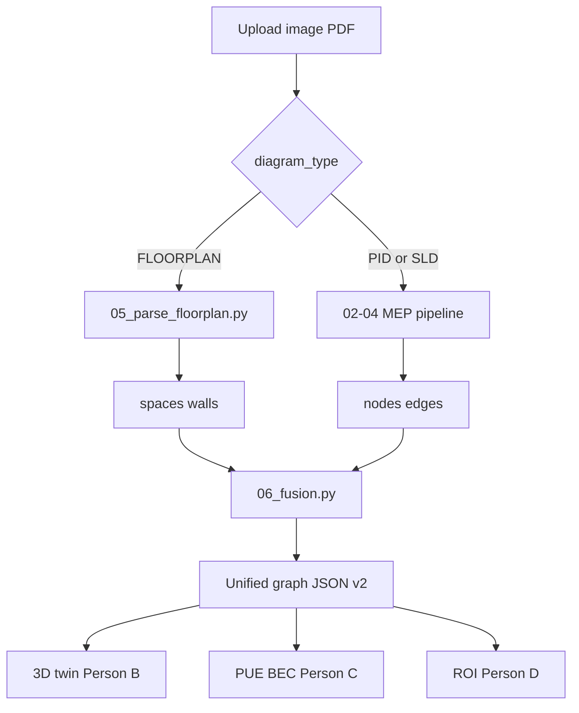

# ArchDraft × FlowDraft — Unified Building Intelligence Engine

**Hackathon:** EuroTech × HKTE · Smart City · Munich 6–7 June 2026 · team of 4 · ~36 hours

**Pivot (judge feedback):** Combine **ArchDraft** (architectural floor-plan vectorization + construction geometry) with **FlowDraft** (energy P&ID/HVAC/SLD parsing + compliance + ROI). One vision pipeline, one graph contract, one 3D digital twin.

**Demo vertical:** **Data centres** — white-space rooms + cooling/power MEP + headline **PUE** metric.

---

## 0. TL;DR — the demo that wins

> Upload a data-centre **floor plan** → walls/rooms/areas vectorized → upload **cooling P&ID + power SLD** → equipment snaps into rooms in **3D** → **PUE + BEC verdict** → raise CHW temp / add containment → **PUE and ROI update live**.

**Critical path:** schema v2 + `demo_datacentre.json` → floor-plan parse → MEP parse → fusion → 3D twin → PUE → ROI → pitch.

**Cut first if behind:** live floor-plan parse, TrOCR dimensions, U-Net walls (use contour fallback), multi-sheet support.

---

## 1. The graph contract (v2)

Single schema: [`schemas/graph.schema.json`](schemas/graph.schema.json)

| Layer | Contents |
|-------|----------|
| **Architecture** | `spaces[]` (rooms), `walls[]` (optional wall polylines) |
| **MEP** | `nodes[]`, `edges[]` (existing P&ID/SLD model) |
| **Fusion** | `node.space_id` links equipment to a room |
| **Meta** | `diagram_type`: `FLOORPLAN` \| `PID` \| `SLD` \| `FUSED`; optional `pue`, `it_power_kW` |

Commit [`data/demo_datacentre.json`](data/demo_datacentre.json) in hour 1 so Person B/C/D work in parallel.

**Rule:** LLM/vision does perception; **deterministic code** computes PUE, BEC pass/fail, ROI.

---

## 2. Unified vision pipeline



### Architectural branch (NEW) — `src/05_parse_floorplan.py`

| Stage | Method | Output |
|-------|--------|--------|
| 1 | Deskew + CLAHE + wall mask (U-Net or HSV/contour fallback) | Binary wall mask |
| 2 | YOLOv8 doors/symbols/text on **512px tiles** | Bounding boxes |
| 3 | TrOCR on crops; normalize `11'4"` / `3.35m` → mm | Room labels, dimensions |
| 4 | Shapely: close walls → room polygons; `area_m2` | `spaces[]`, `walls[]` |

**Datasets:** CVC FPP (U-Net masks), floor-plan YOLO (doors/text), Microsoft Indoor Location (validate pixel→geometry).

### MEP branch (EXISTS) — `src/01`–`04`

- YOLO `models/yolov8n_pid.pt` (203 P&ID classes)
- OCR tags + `class_map.yaml` → engineering types
- Heuristic edges (first-order proximity)

### Fusion — `src/06_fusion.py`

- Point-in-polygon: equipment `bbox_2d` center → `space_id`
- Merge partial graphs into `diagram_type: FUSED`

---

## 3. Team & ownership (4 developers)

### Person A — Architectural Vision Engineer

| | |
|---|---|
| **Mission** | Floor plan → `spaces[]` + `walls[]` with sane areas and labels |
| **Files** | `src/05_parse_floorplan.py`, `notebooks/train_floorplan.ipynb` |
| **Done when** | Data-centre floor plan returns ≥3 rooms with `area_m2` and categories |

**H0–12:** Stage 1–2 (wall mask + tiled YOLO)  
**H12–24:** Stage 3–4 (TrOCR + Shapely rooms)  
**H24–36:** Integration with `/parse?diagram_type=FLOORPLAN`

---

### Person B — 3D / Frontend Engineer

| | |
|---|---|
| **Mission** | Unified digital twin — rooms + MEP in one scene |
| **Spec** | [`docs/VIEWER_SPEC.md`](docs/VIEWER_SPEC.md) |
| **Done when** | `demo_datacentre.json` renders: extruded rooms, equipment in `space_id`, ghost what-if |

**Tasks:** extrude `spaces[].polygon_2d`; stack floors; MEP glyphs inside rooms; click room → area + PUE share; ghost mode; upload UI; `GET /demo-datacentre` fallback.

---

### Person C — Backend: Fusion + PUE + Compliance

| | |
|---|---|
| **Mission** | Router, fusion, deterministic PUE/BEC, what-if API |
| **Files** | `src/06_fusion.py`, `src/pue.py`, `src/api.py`, `bec_rules.yaml` |
| **Done when** | `POST /parse` routes correctly; `GET /compliance/pue` returns verdict on demo graph |

**PUE:** `PUE = facility_power_kW / it_power_kW` (from node attributes + space IT load assumptions).

**BEC:** chiller COP/IPLV thresholds from `bec_rules.yaml` — code evaluates, not LLM.

---

### Person D — Energy/MEP Domain + Finance + Pitch

| | |
|---|---|
| **Mission** | Datacentre class maps, ROI model, deck, demo script |
| **Files** | `class_map.yaml`, `bec_rules.yaml` (thresholds), finance endpoint spec |
| **Done when** | Ghost edit shows payback; 6–8 slides rehearsed |

**ROI:** `ΔPUE × IT_power × hours × tariff` → annual HK$ saving + payback years.

---

## 4. API surface

| Endpoint | Owner | Purpose |
|----------|-------|---------|
| `POST /parse` | A+C | Auto-route or explicit `diagram_type` |
| `POST /fuse` | C | Merge floor-plan + MEP partial graphs |
| `GET /schema` | A | Graph schema v2 |
| `GET /demo-graph` | — | Legacy HVAC demo |
| `GET /demo-datacentre` | C | Fused datacentre demo |
| `GET /compliance/pue` | C | PUE + BEC clause table |
| `POST /whatif` | C | CHW temp / containment → new PUE |
| `POST /finance/roi` | D | CapEx, savings, payback |

---

## 5. Module checklist

### M0 — Contracts (H0–2)
- [ ] Schema v2 committed
- [ ] `demo_datacentre.json` validates
- [ ] Roles locked; API stubs documented

### M1-Arch — Floor plan parsing (Person A)
- [ ] Stage 1 wall mask
- [ ] Stage 2 tiled YOLO
- [ ] Stage 3 TrOCR + unit normalization
- [ ] Stage 4 Shapely rooms + areas

### M1-MEP — P&ID/SLD (exists)
- [x] YOLO + OCR + graph build
- [ ] Datacentre class_map extensions

### M2 — 3D twin (Person B)
- [ ] Room extrusion from `spaces[]`
- [ ] MEP inside `space_id`
- [ ] Ghost what-if coloring

### M3 — PUE + BEC (Person C)
- [ ] `pue.py` deterministic engine
- [ ] `bec_rules.yaml` loaded
- [ ] `/compliance/pue` endpoint

### M4 — What-if (Person C)
- [ ] `POST /whatif` CHW / containment params

### M5 — ROI (Person D)
- [ ] `POST /finance/roi` spec + implementation

### M8 — Pitch (Person D)
- [ ] Demo script + deck + dry-run ×2

---

## 6. Datasets & training

| Domain | Dataset | Notebook |
|--------|---------|----------|
| Walls/rooms | CVC FPP | `notebooks/train_floorplan.ipynb` |
| Doors/symbols | Floor-plan YOLO (Kaggle) | same notebook |
| MEP symbols | P&ID Symbols 203-class | `notebooks/train_yolo_kaggle.ipynb` |

**Deps:** `torch`, `transformers`, `shapely`, `segmentation-models-pytorch` (see `requirements.txt`).

---

## 7. Scope cuts (in order)

1. U-Net → HSV/contour wall extraction  
2. Live floor-plan parse → frozen `demo_datacentre.json` only  
3. TrOCR dims → polygon areas only  
4. **Keep:** rooms in 3D + MEP in rooms + PUE verdict + one ROI number

---

## 8. Why data centres

- **Architecture:** data hall, electrical room, plant room — clear polygons, large areas matter for rack capacity.
- **Energy:** CRAC/CRAH loops + UPS/PDU/busway — same graph model as HVAC P&ID + SLD.
- **Metric:** **PUE** unifies both domains for judges in one number.
- **Regulation:** HK BEC 2024 + audit cycle tightening — same “why now” story as FlowDraft.

---

## 9. Handoff quick-start

```powershell
pip install -r requirements.txt
python -m uvicorn src.api:app --reload
# http://127.0.0.1:8000/docs

python scripts/infer.py graph data/raw_diagrams/images__train__113.jpg  # MEP
python -m src.05_parse_floorplan data/raw_floorplans/sample.png           # Arch (when sample added)
curl http://127.0.0.1:8000/demo-datacentre                               # Fused demo
```

Person B: read [`docs/VIEWER_SPEC.md`](docs/VIEWER_SPEC.md) and load `demo_datacentre.json` first.
