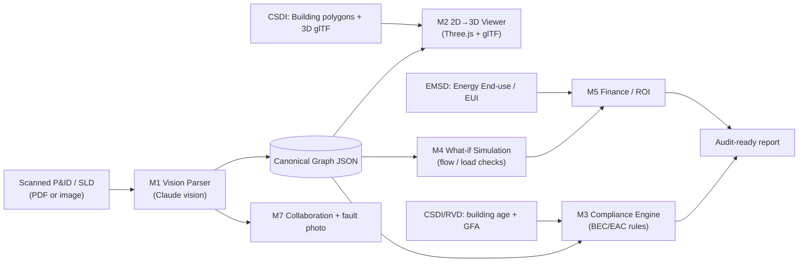

# FlowDraft AI — Hackathon Build Plan

**Intelligent P&ID & SLD Engine** — parse a building's mechanical/electrical schematics into a labeled property graph, render it in 3D, auto-check it against Hong Kong's energy code, and price upgrades.

**Event:** EuroTech × HKTE Hackathon, Munich, 6–7 June 2026 · Smart City track · team of 4 · ~36 hours · Claude credits provided.

---

## 0. TL;DR — what we must land

The demo that wins is a single unbroken flow:

> **Upload a messy P&ID/SLD → see it become a 3D system graph → get a BEC compliance verdict → drag in a new chiller → watch the ROI and the compliance status update live.**

Everything else (collaboration, on-site fault photo, VPP/demand-response) is a *bonus* you mention in the pitch, not a thing you risk the demo on.

**Why now (open the pitch with this):** Hong Kong’s green-energy push (EVs, electrification, waste reduction) is loading the grid — audits tightened from every **10 years → 5 years**, and non-electric vehicle licensing winds down toward **2035**. **BEC 2024 & EAC 2024** (energy codes) have been mandatory since **23 August 2025**. The **Buildings Energy Efficiency (Amendment) Ordinance 2025** rolls out in two stages — **20 September 2025** and **20 September 2026** — expanding which building types must comply and be audited (audit scope grows from 2 → **11** types; BEC scope from 13 → **15**), shortening the audit cycle to **5 years**, and requiring **public disclosure** of audit technical data for audits completed on/after **20 Sep 2026** (EAC 2024 Addendum No. 1/2025). Buildings are ~90% of HK electricity and >50% of its carbon. There are ~2,700 already-audited commercial buildings plus thousands of newly categorized ones, all needing audit-ready documentation on a legal deadline.

---

## 1. The one decision that makes or breaks the team: the Graph contract

Before anyone writes feature code, agree on **one JSON schema** for the parsed system. Every module reads/writes *only* this. Parser produces it; viewer, compliance, simulation, and finance all consume it. This lets four people work in parallel against mock data without blocking each other.

```jsonc
// graph.schema.json  — the single source of truth
{
  "meta": {
    "diagram_id": "demo-01",
    "diagram_type": "PID | SLD",
    "building_id": "CSDI BuildingCSUID or null",
    "source_file": "chiller_plant.png",
    "parse_confidence": 0.0
  },
  "nodes": [
    {
      "id": "N1",
      "type": "chiller | pump | cooling_tower | ahu | fcu | boiler | fan | transformer | switchgear | breaker | distribution_panel | meter | valve | sensor",
      "tag": "CH-1",                       // equipment tag read off the drawing
      "attributes": {
        "rated_power_kW": 350,
        "capacity": { "value": 500, "unit": "RT" },     // RT, kW, L/s, CMH...
        "efficiency": { "metric": "COP | IPLV | kW/RT | EER", "value": 5.2 },
        "voltage_V": 380,
        "install_year": 2009,
        "manufacturer": null,
        "model": null,
        "floor": "B2"
      },
      "bbox_2d": [x, y, w, h],             // location on the source image (for the fault-photo locator)
      "confidence": 0.0
    }
  ],
  "edges": [
    {
      "id": "E1",
      "type": "chw_supply | chw_return | condenser_water | air_duct | electrical_cable | control_signal",
      "from": "N1",
      "to": "N2",
      "attributes": { "diameter_mm": 200, "medium": "chilled_water", "flow_lps": 30, "ampacity_A": 400, "phase": 3 },
      "polyline_2d": [[x, y]],
      "confidence": 0.0
    }
  ]
}
```

Commit a `mock_graph.json` in hour 1 so M2/M3/M4/M5 can start immediately, before M1 produces anything real.

**Architectural rule of thumb:** Claude does *perception and prose* (reading the diagram, drafting the report). **Deterministic code does the math** (compliance thresholds, load sums, ROI). Never let the LLM compute a compliance pass/fail at runtime — judges will (rightly) distrust it, and it won't be reproducible.

---

## 2. Team & ownership (4 people)

| Role | Owns | Modules |
|---|---|---|
| **AI/ML Engineer** | Vision parsing → graph; fault-photo locator | M1, M7-photo |
| **3D / Frontend Engineer** | The 2D→3D viewer + the whole UI (this is the showpiece) | M2, M7-UI |
| **Backend / Data Engineer** | HK data pipeline, compliance rules engine, simulation | M3, M4, M6 |
| **Product / Domain + Pitch** | BEC/EAC rule extraction, finance model, demo script, deck, TAM math | M5, M8 |

Roles overlap deliberately — pair up during integration (hours 24–30).

### 2.1 Per-person delegation briefs

Hand these to each teammate. Every brief assumes **`graph.schema.json`** + **`mock_graph.json`** exist after M0.

---

#### Person A — AI/ML Engineer

| | |
|---|---|
| **Mission** | Turn P&ID/SLD images into valid, schema-conformant Graph JSON. |
| **Modules** | **M1** (critical), **M7-photo** (bonus) |
| **Critical path** | One demo diagram parses → graph renders in M2 |
| **Bonus (cut if behind)** | Multi-tile parsing, YOLO fallback, fault-photo locator |

**Handoff contract**

| Direction | Artifact |
|---|---|
| **Consumes** | `graph.schema.json`, symbol legend, 2–3 sample diagrams (PDF/image) |
| **Produces** | `POST /parse` → Graph JSON; `demo_graph.json` (frozen fallback); optional low-confidence node list for UI correction |

**Blocked by:** M0.3 (schema committed) · **Unblocks:** M2, M3, M4, M5, M7-photo

**Checklist by window**

| Window | Must complete |
|---|---|
| **H0–12** | Preprocess pipeline; first Claude vision call with structured output; validate against schema; wire parse to return JSON |
| **H12–24** | One real demo diagram end-to-end; confidence scores on nodes; merge logic for tiled parses (if needed) |
| **H24–36** | Integration with upload UI; freeze `demo_graph.json`; support live parse + fallback switch |

---

#### Person B — 3D / Frontend Engineer

| | |
|---|---|
| **Mission** | Own the showpiece: 2D→3D viewer, main UI shell, demo interactions. |
| **Modules** | **M2** (critical), **M7-UI** (bonus) |
| **Critical path** | Mock graph → 3D scene → click node → side panel; ghost edit + M4/M3 status colors |
| **Bonus (cut if behind)** | Full app chrome, collaboration UI, fault-photo upload UI |

**Handoff contract**

| Direction | Artifact |
|---|---|
| **Consumes** | Graph JSON (mock then live); optional `building_context.json` from M6 (`BuildingCSUID`, glTF URL); compliance/sim results from M3/M4/M5 APIs |
| **Produces** | React app: 3D canvas (`react-three-fiber`), upload flow, node inspector, system toggles, ROI/compliance panels |

**Blocked by:** M0.4 (mock graph loads) · **Unblocks:** demo UX, M7-UI, integration polish

**Checklist by window**

| Window | Must complete |
|---|---|
| **H0–12** | R3F scene + orbit controls; render mock graph (glyphs + tubes); floor Z-stacking; system color legend |
| **H12–24** | Click → side panel; ghost replacement mode; load CSDI glTF shell (§5.3 Route B); wire M4 overload coloring |
| **H24–36** | Single-click demo path; building search → shell; pre-parsed fallback toggle; record backup screen capture |

---

#### Person C — Backend / Data Engineer

| | |
|---|---|
| **Mission** | HK open-data pipeline, deterministic compliance + simulation, APIs the frontend calls. |
| **Modules** | **M3**, **M4**, **M6** (all critical for data story) |
| **Critical path** | `bec_rules.yaml` checks; SLD downstream load check; building lookup by name |
| **Bonus (cut if behind)** | P&ID hydraulic path, lead-gen batch query, WFS instead of ArcGIS REST |

**Handoff contract**

| Direction | Artifact |
|---|---|
| **Consumes** | Graph JSON; `bec_rules.yaml` (from Person D extraction); CSDI/RVD/EMSD data per §7 |
| **Produces** | `GET /compliance?diagram_id=` → clause table; `POST /whatif` → OK/NOT-OK; `GET /building?q=` → age, GFA, storeys, glTF path; `GET /leads/audit-due` (stretch) |

**Blocked by:** M0 schema; Person D delivers `bec_rules.yaml` skeleton by H8 · **Unblocks:** M2 side panel, M5 benchmarks, pitch “audit-due” slide

**Checklist by window**

| Window | Must complete |
|---|---|
| **H0–12** | FastAPI/Express scaffold; first CSDI Building query; NetworkX graph from JSON; M3 rules file stub |
| **H12–24** | Deterministic BEC checks; SLD `breaker_overloaded`; M6 building + glTF resolver; cache downloaded EMSD CSV |
| **H24–36** | Wire all endpoints to UI; integration tests on `mock_graph.json`; lead-gen query if time |

---

#### Person D — Product / Domain + Pitch

| | |
|---|---|
| **Mission** | Extract BEC/EAC into machine-readable rules, finance/ROI model, pitch deck + demo script. |
| **Modules** | **M5**, **M8** (+ support M3 rule extraction) |
| **Critical path** | `bec_rules.yaml` with real thresholds; ROI number on screen; 6-slide deck + rehearsed script |
| **Bonus (cut if behind)** | HKEX/IFRS S2 ESG line, TAM spreadsheet, full EAC report prose |

**Handoff contract**

| Direction | Artifact |
|---|---|
| **Consumes** | BEC/EAC PDFs (EMSD); Graph JSON; M4 what-if results; EMSD Energy End-use CSV |
| **Produces** | `bec_rules.yaml` (by H8); `POST /finance/roi` inputs/outputs spec; pitch deck; demo script with fallback cues |

**Blocked by:** M0 · **Unblocks:** M3 deterministic checks, M5, M8

**Checklist by window**

| Window | Must complete |
|---|---|
| **H0–12** | Download BEC 2024 + EAC 2024 PDFs; extract 10–15 key numeric rules into YAML; tariff + hours assumptions doc |
| **H12–24** | ROI formula implemented with Person C; EUI benchmark vs EMSD 2025 table; draft deck outline |
| **H24–36** | Final deck; demo script (live vs fallback); TAM one-liner; rehearse with team twice |

---

#### Cross-team integration matrix (H24–30)

| Producer | Consumer | Integration checkpoint |
|---|---|---|
| Person A → Graph JSON | Person B, C | Upload → parse → 3D refresh without manual copy-paste |
| Person C → `/compliance`, `/whatif` | Person B | Node click shows pass/fail + overload color |
| Person C → `/building` | Person B | Search “Cyberport” → shell + metadata in panel |
| Person D → `/finance/roi` | Person B | Ghost chiller → payback appears |
| Everyone | Person D | One dry-run of full demo path before H34 |

---

## 3. Architecture



**Suggested stack:** React + Vite, `react-three-fiber`/Three.js (3D), FastAPI or Express (backend), NetworkX or graphology (graph + simulation), Anthropic SDK (vision), Supabase/SQLite (persistence if you do collaboration). Keep it boring; spend novelty budget on the model and the 3D.

---

## 4. Module breakdown

Each module: **Goal · Owner · Depends on · Done when · Stretch** + atomic **Tasks** checklist.

Format: `- [ ] ID — task — deps — ~hours — done: acceptance criterion`

---

### M0 — Scaffolding & shared contracts · *everyone · hours 0–2*

- **Goal:** One repo, one schema, one mock graph — everyone unblocked in parallel.
- **Owner:** Everyone (Person C leads repo; Person A owns schema)
- **Depends on:** Nothing
- **Done when:** Every dev runs `npm run dev` / `uvicorn` and loads `mock_graph.json` locally.
- **Stretch:** CI lint + JSON schema validation on commit

**Tasks (~2h total)**

- [ ] **M0.1** — Init monorepo (React/Vite + FastAPI or Express) with `README` run commands — deps: none — ~0.5h — done: `npm run dev` + backend health `GET /health` return 200
- [ ] **M0.2** — Commit `graph.schema.json` (JSON Schema) matching §1 — deps: none — ~0.5h — done: `ajv` or similar validates example object
- [ ] **M0.3** — Commit `mock_graph.json` (≥8 nodes, 2 systems, 1 SLD-style subtree) — deps: M0.2 — ~0.5h — done: M2/M3/M4 can import without M1
- [ ] **M0.4** — Set `ANTHROPIC_API_KEY` + `.env.example`; document in README — deps: none — ~0.25h — done: Person A can call Claude locally
- [ ] **M0.5** — Collect 2–3 sample P&ID/SLD images (Azure P&ID dataset / synthetic) — deps: none — ~0.25h — done: files in `samples/`
- [ ] **M0.6** — Agree API contracts: `POST /parse`, `GET /compliance`, `POST /whatif`, `GET /building`, `POST /finance/roi` — deps: M0.2 — ~0.25h — done: `docs/api.md` or OpenAPI stub checked in

---

### M1 — Diagram ingestion & parsing (Vision → Graph) · *Person A · hours 2–18*

- **Goal:** Image/PDF of a P&ID or SLD → valid Graph JSON.
- **Owner:** Person A
- **Depends on:** M0.2, M0.3, M0.4
- **Done when:** One real demo diagram parses to a graph the viewer renders correctly.
- **Stretch:** YOLO + OCR fallback; multi-diagram support

**Tasks (~14h)**

- [ ] **M1.1** — PDF → PNG rasterizer (e.g. `pdf2image`) — deps: M0.5 — ~1h — done: multi-page PDF yields one image per sheet
- [ ] **M1.2** — Preprocess: deskew, resize longest edge ≈1568px, normalize contrast — deps: M1.1 — ~1h — done: output passes size/token budget in §7d
- [ ] **M1.3** — Claude vision prompt + system message with symbol legend few-shot — deps: M0.4 — ~1h — done: manual test returns JSON-like structure
- [ ] **M1.4** — Wire **structured outputs** to `graph.schema.json` (§7d) — deps: M1.3, M0.2 — ~2h — done: response validates with schema; reject/repair on failure
- [ ] **M1.5** — Extract nodes: `type`, `tag`, `attributes`, `bbox_2d`, `confidence` — deps: M1.4 — ~2h — done: ≥90% of visible equipment tags present on demo sheet
- [ ] **M1.6** — Extract edges: `from`, `to`, `type`, `polyline_2d` — deps: M1.5 — ~2h — done: main plant loop connected (no orphan chiller)
- [ ] **M1.7** — Tile-merge for dense drawings (optional) — deps: M1.6 — ~2h — done: second test sheet parses without duplicate node IDs
- [ ] **M1.8** — `POST /parse` endpoint + error handling — deps: M1.6 — ~1h — done: curl upload returns Graph JSON
- [ ] **M1.9** — Freeze `demo_graph.json` from best parse — deps: M1.8 — ~0.5h — done: file committed; used as demo fallback
- [ ] **M1.10** — Low-confidence node list for UI correction — deps: M1.8 — ~1h — done: nodes with `confidence < 0.7` flagged in response
- [ ] **M1.11** — Integration: upload in UI triggers parse → graph state — deps: M1.8, M2.1 — ~1.5h — done: end-to-end without manual JSON paste

---

### M2 — 2D→3D reconstruction & viewer · *Person B · hours 2–24* · **see §5**

- **Goal:** Turn the graph into an explorable 3D model, optionally inside a real HK building shell.
- **Owner:** Person B
- **Depends on:** M0.3; M6.5 for shell (can stub until H12)
- **Done when:** Labeled 3D glyphs, colored tubes by system, orbit/click, ghost edits with M4 coloring.
- **Stretch:** Path B geometric extrusion; IFC export mention only

**Tasks (~18h)**

- [ ] **M2.1** — R3F canvas + `OrbitControls` + lighting — deps: M0.1 — ~1h — done: empty scene runs in browser
- [ ] **M2.2** — Load `mock_graph.json` into React state — deps: M0.3, M2.1 — ~0.5h — done: graph in context/store
- [ ] **M2.3** — **System split:** partition nodes/edges by `chw_*`, `condenser_*`, `air_duct`, `electrical_*`, `control_*` — deps: M2.2 — ~1h — done: toggle hides/shows each system
- [ ] **M2.4** — **Floor Z-stack:** map `attributes.floor` → Z offset (e.g. B2=-6, G=0, L1=3) — deps: M2.3 — ~1h — done: multi-floor mock visibly separated
- [ ] **M2.5** — **2D layout per floor:** `d3-force-3d` or hierarchical layout in X/Y — deps: M2.4 — ~2h — done: no overlapping glyphs; plant→load left-to-right
- [ ] **M2.6** — **Instanced glyphs** per `node.type` (box/cylinder/custom GLB) — deps: M2.5 — ~2h — done: chiller ≠ pump ≠ breaker visually
- [ ] **M2.7** — **`TubeGeometry`** edges along `CatmullRomCurve3`; color by `edge.type`; radius ∝ `diameter_mm` / thickness ∝ `ampacity_A` — deps: M2.5 — ~2h — done: pipes thicker when attribute present
- [ ] **M2.8** — **Labels:** `Html`/`Text` from `drei` showing `tag` — deps: M2.6 — ~1h — done: tags readable at default zoom
- [ ] **M2.9** — **Click node** → side panel (attributes + placeholder compliance) — deps: M2.6 — ~1.5h — done: panel updates on selection
- [ ] **M2.10** — **Ghost mode:** semi-transparent duplicate node for proposed swap — deps: M2.6 — ~1.5h — done: user can place ghost chiller/pump
- [ ] **M2.11** — **M4 coloring:** overload edges red, OK green (consume `/whatif`) — deps: M2.10, M4.5 — ~1h — done: swap triggers visible edge recolor
- [ ] **M2.12** — **Building shell Route B:** query M6 → fetch `Format_glTF` → `GLTFLoader`, opacity 0.15 — deps: M6.5 — ~2h — done: demo building shell surrounds graph
- [ ] **M2.13** — Align graph origin inside shell bounding box (manual offset OK) — deps: M2.12 — ~1h — done: system reads “inside building”
- [ ] **M2.14** — Upload UI + loading states — deps: M1.11, M2.1 — ~1h — done: spinner during parse
- [ ] **M2.15** — Demo polish: legend, system toggles, screenshot-friendly camera — deps: M2.7 — ~1.5h — done: one-click reset camera button

---

### M3 — Compliance engine (BEC/EAC) · *Person C + Person D · hours 4–22*

- **Goal:** Deterministic check vs BEC 2024; audit-style report scaffold.
- **Owner:** Person C (engine); Person D (rule extraction)
- **Depends on:** M0.3; `bec_rules.yaml` from Person D by H8
- **Done when:** Clause table + downloadable report JSON/PDF stub.
- **Stretch:** Full EAC 2024 report template with Claude prose

**Tasks (~12h)**

- [ ] **M3.1** — Download BEC 2024 + EAC 2024 + TG-BEC 2024 from `emsd.gov.hk/beeo` — deps: none — ~0.5h — done: PDFs in `data/regulatory/`
- [ ] **M3.2** — Extract **10–15 numeric rules** into `bec_rules.yaml` (COP, IPLV, LPD, motor eff.) — deps: M3.1 — ~3h — done: each rule has `clause`, `metric`, `threshold`, `unit`
- [ ] **M3.3** — Node→BEC category mapper (rules table by `node.type`) — deps: M3.2 — ~1h — done: every mock node has a category
- [ ] **M3.4** — Deterministic evaluator: pass/fail + actual vs limit — deps: M3.2, M0.3 — ~2h — done: same input → same output every run
- [ ] **M3.5** — `GET /compliance?diagram_id=` returns clause array — deps: M3.4 — ~1h — done: JSON list `{clause, status, actual, limit}`
- [ ] **M3.6** — Wire compliance into M2 side panel — deps: M3.5, M2.9 — ~1h — done: click node shows relevant clauses
- [ ] **M3.7** — Report generator: structured JSON + Claude prose wrapper (optional) — deps: M3.5 — ~2h — done: “Download report” yields file
- [ ] **M3.8** — Use `DomesticGFA`/`NonDomesticGFA` from M6 for intensity denominators — deps: M6.3, M3.4 — ~1.5h — done: W/m² or kW/RT per GFA when data present

---

### M4 — "What-if" simulation (topological impact) · *Person C · hours 6–26*

- **Goal:** Swap equipment → OK / NOT-OK + limiting constraint.
- **Owner:** Person C
- **Depends on:** M0.3
- **Done when:** `POST /whatif` returns status live on ghost edit.
- **Stretch:** P&ID first-order hydraulic path

**Tasks (~10h)**

- [ ] **M4.1** — Build `networkx.DiGraph` from Graph JSON — deps: M0.3 — ~0.5h — done: graph mirrors nodes/edges
- [ ] **M4.2** — **SLD:** `downstream_load_kW` recursive sum — deps: M4.1 — ~1.5h — done: matches hand calculation on mock tree
- [ ] **M4.3** — **SLD:** `breaker_overloaded` at 80% ampacity (3-phase formula §7d) — deps: M4.2 — ~1.5h — done: inject overload → NOT-OK
- [ ] **M4.4** — Apply node attribute swap → re-run checks — deps: M4.3 — ~1h — done: higher `rated_power_kW` can trip breaker
- [ ] **M4.5** — `POST /whatif` `{node_id, new_attributes}` → `{status, limiting_node, detail}` — deps: M4.4 — ~1h — done: API documented
- [ ] **M4.6** — P&ID stub: junction flow balance + pump head vs friction (first-order) — deps: M4.1 — ~3h — done: labeled “first-order” in response
- [ ] **M4.7** — Integration with M2 ghost mode — deps: M4.5, M2.10 — ~1.5h — done: drag ghost → automatic what-if call

---

### M5 — Finance & ROI · *Person D + Person C · hours 6–24*

- **Goal:** CapEx vs OpEx for an upgrade; benchmark vs HK averages.
- **Owner:** Person D (model); Person C (endpoint)
- **Depends on:** M4 what-if output; EMSD CSV (M6.4)
- **Done when:** New chiller shows $ savings + payback on screen.
- **Stretch:** HKEX/IFRS S2 Scope 1/2 line

**Tasks (~8h)**

- [ ] **M5.1** — Equipment CapEx lookup table (chiller, pump, AHU — order-of-magnitude HK$) — deps: none — ~1h — done: YAML/CSV with 5 SKUs
- [ ] **M5.2** — OpEx: `Δefficiency × hours × tariff` (document assumptions) — deps: none — ~1h — done: formula in `finance.py`
- [ ] **M5.3** — Payback + simple NPV (5–10 yr) — deps: M5.1, M5.2 — ~1h — done: unit test on mock numbers
- [ ] **M5.4** — Load EMSD Energy End-use 2025 CSV; sector EUI benchmarks — deps: M6.4 — ~1.5h — done: “vs HK office average” line
- [ ] **M5.5** — `POST /finance/roi` — deps: M5.3, M4.5 — ~1h — done: returns `{capex, annual_saving, payback_years}`
- [ ] **M5.6** — UI panel wired to ghost swap — deps: M5.5, M2.10 — ~1.5h — done: numbers update on what-if
- [ ] **M5.7** — (Stretch) `kWh_saved × grid_factor` → ESG snippet — deps: M5.5 — ~1h — done: one line in report

---

### M6 — HK data integration · *Person C · hours 4–20* · **see §7**

- **Goal:** Anchor diagram to real HK building; benchmarks + lead-gen.
- **Owner:** Person C
- **Depends on:** M0.1
- **Done when:** Building name → age, GFA, storeys, glTF URL.
- **Stretch:** Batch audit-due map layer

**Tasks (~10h)**

- [ ] **M6.1** — Copy ArcGIS REST base URL from CSDI Building dataset API tab — deps: none — ~0.25h — done: URL in `config/csdi.json`
- [ ] **M6.2** — **Name lookup:** query BuildingName table → `BuildingCSUID` → polygon layer (§7b) — deps: M6.1 — ~2h — done: “Cyberport” returns CSUID
- [ ] **M6.3** — Join `OP` / `OPStructure` for `OPDate`, GFA, `Storeys` — deps: M6.2 — ~2h — done: metadata object returned
- [ ] **M6.4** — Download EMSD `hk-emsd-emsd1-energy-end-use-data-2025` CSV tables — deps: none — ~0.5h — done: `data/emsd/` cached locally
- [ ] **M6.5** — Resolve **glTF path** from 3D Visualisation Map (Individualised) layer — deps: M6.2 — ~2h — done: `Format_glTF` URL in building response
- [ ] **M6.6** — `GET /building?q=` — deps: M6.3, M6.5 — ~1h — done: JSON consumed by M2.12
- [ ] **M6.7** — **Audit-due lead-gen:** RVD Names of Buildings via DATA.GOV.HK filter (§7a) — deps: none — ~2h — done: list buildings with completion year ≤ 2021 (5-yr cycle)
- [ ] **M6.8** — (Stretch) Email Lands Dept `3dmap@landsd.gov.hk` for 3D Tiles API key — deps: none — ~0.5h — done: key in `.env` if granted

---

### M7 — Collaboration & on-site fault capture · *Person B + Person A · hours 20–30 (bonus)*

- **Goal:** Comments on nodes; fault photo → matched equipment.
- **Owner:** Person B (UI); Person A (vision match)
- **Depends on:** M1, M2 solid
- **Done when:** Optional demo only.
- **Stretch:** Real-time multi-user

**Tasks (~6h, cut first)**

- [ ] **M7.1** — Comment thread per `node.id` in SQLite/Supabase — deps: M2.9 — ~2h — done: comment persists on refresh
- [ ] **M7.2** — Fault photo upload → Claude reads nameplate — deps: M1.3 — ~2h — done: returns `{tag, model, serial}`
- [ ] **M7.3** — Match to node via `tag` or `bbox_2d` proximity — deps: M7.2 — ~2h — done: fault pinned on 3D node

---

### M8 — Pitch, demo script, deck · *Person D + everyone · hours 30–36*

- **Goal:** Win judges with story + reliable demo.
- **Owner:** Person D (lead); everyone contributes screenshots
- **Depends on:** M1–M5 integration
- **Done when:** Rehearsed 5–7 min demo + 6–8 slides.
- **Stretch:** Lead-gen slide with live count

**Tasks (~4h)**

- [ ] **M8.1** — TAM: audited buildings × fee × 5-yr recurrence — deps: none — ~0.5h — done: one slide with sourced assumptions
- [ ] **M8.2** — Demo script: happy path + fallback (pre-parsed graph) — deps: M1.9 — ~1h — done: timed script ≤7 min
- [ ] **M8.3** — Deck: problem (HK regulation) → product → data → demo screenshot → GBA scale — deps: M2.15 — ~1.5h — done: PDF/Google Slides link
- [ ] **M8.4** — Team dry-run ×2 before H36 — deps: M8.2 — ~1h — done: no blocker bugs on critical path

---

## 5. Deep-dive: the 2D→3D module (your part)

This is the most misunderstood and most impressive piece, so get the mental model right first.

### 5.1 The key insight: a P&ID/SLD is *topological*, not *geometric*

A P&ID or single-line diagram is a **schematic**. It encodes *what connects to what*, **not** real-world coordinates. There is no "true" 3D hiding in the drawing to recover. So "convert 2D→3D" really means **two different things**, and you should be explicit about which you're doing:

- **Path A — Layout the graph in 3D (do this).** Take the parsed property graph and *compute* a 3D arrangement: equipment as 3D glyphs, connections as 3D tubes, organized by system and by floor. This is fast, always works, and looks great. The "intelligence" is in the parse + the layout, not in pretending the schematic had geometry.
- **Path B — Geometric extrusion (only if you have a real geometric layout).** If the input is an actual *scaled* MEP floor-plan/CAD layout (centerlines with real coordinates and pipe sizes) rather than a schematic, you can sweep a tube of the correct diameter along each centerline polyline to get true geometry. More impressive *if* you have such a drawing; most P&IDs are not this.

For the hackathon: **build Path A**, and *anchor it inside the real building shell* (the CSDI glTF) so it reads as "this system, in this Hong Kong building." Mention Path B / IFC export as roadmap.

### 5.2 Path A algorithm

1. **Layer by system:** split nodes/edges into chilled-water, condenser-water, air, electrical, control.
2. **Assign a Z per floor:** use the `floor` attribute (or topological depth from the main plant) to stack systems vertically — this instantly looks like a building riser diagram.
3. **2D layout per layer:** run a force-directed layout (`d3-force-3d`) or a hierarchical layout (plant/source on one side, terminals on the other) to place nodes within each floor plane.
4. **Render:** instanced 3D glyphs per equipment type (a chiller box, a pump, a transformer), text labels with the `tag`, and edges as `TubeGeometry` along a smoothed path, colored by `edge.type`. Pipe radius ∝ `diameter_mm`; cable thickness ∝ `ampacity_A`.
5. **Interactions:** orbit controls; click a node → side panel with attributes + compliance status; toggle systems on/off; **"ghost" mode** — render a proposed replacement node semi-transparent and re-color downstream edges that M4 flags as overloaded (red) vs fine (green).

### 5.3 Anchoring in the real building — two CSDI routes (pick one for the hackathon)

CSDI exposes **two different 3D delivery mechanisms**. Do not mix them up — they need different loaders.

| Route | What you get | Loader | Hackathon? |
|---|---|---|---|
| **A — 3D Tiles (streaming Map API)** | Territory-wide mesh tilesets (WGS84) | **CesiumJS** or `3d-tiles-renderer` | Only if you already have a **free API key** from Lands Dept (`3dmap@landsd.gov.hk`) |
| **B — glTF file paths (dataset download)** | Per-building `Format_glTF` URL from **3D Visualisation Map (Individualised models)** | Three.js **`GLTFLoader`** | **Recommended** — matches your R3F stack |

**Route A (3D Tiles)** — for city-scale context, not per-equipment placement:

```
https://data.map.gov.hk/api/3d-data/3dsd/WGS84/building/tileset.json?key=<API_KEY>
https://data.map.gov.hk/api/3d-data/3dsd/WGS84/infrastructure/tileset.json?key=<API_KEY>
```

Docs: [CSDI 3D Spatial Data API](https://portal.csdi.gov.hk/csdi-webpage/apidoc/3d-spatial-data-api). CRS is **WGS84**; your graph layout stays in a local origin — do not try to georeference every pipe segment to WGS84 in 36 hours.

**Route B (glTF shell) — do this:**

1. Person C resolves building via M6 → returns `Format_glTF` URL (from ArcGIS query on dataset `landsd_rcd_1671676915450_88604`, layer `Individualised_models`).
2. Person B `fetch(url)` → `GLTFLoader.load` → `scene.add` with `opacity ≈ 0.15`.
3. Place the **computed** system graph (Path A layout) inside the shell’s bounding box; a constant `(offsetX, offsetY, offsetZ)` is fine.

Native dataset CRS is **EPSG:2326 (HK1980 Grid)**. For a standalone Three.js scene, work in **local units** after the glTF loads. Use `proj4` (2326→4326) only if you also embed a 2D web map. For room-level accuracy, the **3D Indoor Map** dataset is the interior counterpart (future work).

Preview buildings interactively: [https://3d.map.gov.hk](https://3d.map.gov.hk) / Open3Dhk.

### 5.4 Output "3D format"

Skip **DWG** (heavy CAD, slow to generate). Ship these:

| Output | Purpose |
|---|---|
| **Graph JSON** | Source of truth for compliance, simulation, finance |
| **Three.js scene** (in-browser) | Demo + screenshots |
| **glTF shell** (optional, from CSDI) | “This plant, in this HK building” |
| **IFC** (roadmap only) | BIM interoperability story for judges |

Path B geometric extrusion from real MEP CAD centerlines remains roadmap — most hackathon P&IDs are schematics (§5.1).

### 5.5 Stack
`react-three-fiber` + `drei` (helpers) + `three`'s `GLTFLoader` + `TubeGeometry`/`CatmullRomCurve3`; `d3-force-3d` for layout. All client-side, no backend dependency to demo.

---

## 6. 36-hour timeline & demo-critical path

| Window | Focus |
|---|---|
| **H0–2** | M0 scaffolding; lock the graph schema + mock data; API keys |
| **H2–8** | M1 first parse; M2 renders mock graph in 3D; M3 rules skeleton; M6 first CSDI call |
| **H8–18** | Core build in parallel; M1 nails one real diagram; M2 anchors in glTF; M4 SLD load check |
| **H18–24** | M5 ROI live; M3 report generates; **sleep in shifts** |
| **H24–30** | **Integration** — wire parse→3D→compliance→ROI into one click; pair up; freeze scope |
| **H30–34** | Polish the demo path; record a fallback screen-capture; M7 fault-photo if green |
| **H34–36** | Deck, demo script rehearsal, buffer |

**Critical path (must work):** M0 → M1(one diagram) → M2(3D) → M3(verdict) → M5(a number) → M8(story). **Bonus (cut first if behind):** M7, Path B, VPP, multi-diagram support, full collaboration.

---

## 7. Data & API guide (concrete cookbook)

> **Scope reality:** real P&IDs/SLDs are **proprietary** (your future moat). Open HK APIs supply **building context, benchmarks, and compliance rulesets** — not customer diagrams. Use synthetic/redacted samples for the demo.

**Official references**

| Portal | Docs |
|---|---|
| DATA.GOV.HK | [API specification](https://data.gov.hk/en/help/api-spec) |
| CSDI | [GeoSpatial Services](https://portal.csdi.gov.hk/csdi-webpage/doc/GeoSpatialServices) · [Dataset API Explorer](https://portal.csdi.gov.hk/csdi-webpage/info/apiQuery) |
| EMSD BEEO | [Codes & Technical Guidelines](https://www.emsd.gov.hk/beeo/en/mibec_beeo_codtechguidelines.html) |

**Hosts:** `api.data.gov.hk` and `app.data.gov.hk` both work for historical-archive paths; prefer **`https://api.data.gov.hk`** for `/v2/filter`. All times **GMT+8**.

---

### 7a. DATA.GOV.HK (tabular: EMSD benchmarks + RVD lead-gen)

#### Provider IDs you'll use

| Provider ID | Use |
|---|---|
| `hk-emsd` | Energy End-use Data 2025 |
| `hk-rvd` | Names of Buildings (completion year) |
| `hk-landsd` | Lands tabular exports (if any) |
| `clp`, `hkelectric`, `towngas` | (Stretch) utility open data |

#### A — v2 Filter API (best for lead-gen)

Server-side filter on any CSV resource URL listed on a dataset page.

```
GET https://api.data.gov.hk/v2/filter?q=<URL-encoded JSON>
```

**`q` object shape:**

```json
{
  "resource": "https://www.rvd.gov.hk/datagovhk/psi/names_of_buildings_vol1_eng.csv",
  "section": 1,
  "format": "json",
  "filters": [[<col>, "<op>", ["<val>"]]],
  "sorts": [[<col>, "asc"]]
}
```

**Operators:** `eq`, `ne`, `in`, `ni`, `lt`, `le`, `gt`, `ge`, `bt` (between, 2 operands), `ct`, `nct`, `bw`, `nbw`, `ew`, `new`.

**Important:** `col` is **1-based column index** in the CSV (check the file header row on the dataset page). Discover columns by downloading once or reading the data dictionary.

```python
import json, urllib.parse, requests

q = {
    "resource": "https://www.rvd.gov.hk/datagovhk/psi/names_of_buildings_vol1_eng.csv",
    "section": 1,
    "format": "json",
    "filters": [
        # Example: column 4 = year of completion — VERIFY column index on dataset page
        [4, "le", ["2001"]],   # completed 2001 or earlier → due 5-yr audit if last audit ~2016
    ],
    "sorts": [[4, "asc"]],
}
url = "https://api.data.gov.hk/v2/filter?" + urllib.parse.urlencode({"q": json.dumps(q)})
rows = requests.get(url, timeout=60).json()
# Pitch: "N buildings in HK Island/Kowloon now on the 5-year audit cycle"
```

**Dataset pages**

| Dataset | Slug / link |
|---|---|
| Names of Buildings | [hk-rvd-tsinfo_rvd-names-of-buildings](https://data.gov.hk/en-data/dataset/hk-rvd-tsinfo_rvd-names-of-buildings) |
| Energy End-use 2025 | [hk-emsd-emsd1-energy-end-use-data-2025](https://data.gov.hk/en-data/dataset/hk-emsd-emsd1-energy-end-use-data-2025) |

For M5 benchmarks, download **Table 11** (total consumption by end-use) CSV from the 2025 dataset and cache locally — no need to query live in the demo.

#### B — Historical Archive API (snapshots & file discovery)

| Endpoint | Purpose |
|---|---|
| `GET /v1/historical-archive/list-files` | Find files by `start`, `end`, optional `category`, `provider`, `format`, `search`, `skip` |
| `GET /v1/historical-archive/list-file-versions` | Versions of one `url` between dates (**max 10,000** results) |
| `GET /v1/historical-archive/get-file` | Download snapshot — returns **302** → follow redirect |
| `GET /v1/historical-archive/get-schema` | Schema at `date` |
| `GET /v1/historical-archive/get-data-dictionary` | Data dictionary at `date` |

```python
import requests

BASE = "https://api.data.gov.hk/v1/historical-archive"

# 1) Discover EMSD CSV resources
listing = requests.get(f"{BASE}/list-files", params={
    "start": "20250101", "end": "20251231",
    "provider": "hk-emsd", "format": "csv",
}).json()

# 2) Download a specific file snapshot (follow redirects!)
resp = requests.get(f"{BASE}/get-file", params={
    "url": "<RESOURCE_URL_FROM_DATASET_PAGE>",
    "time": "20251028-0000",   # YYYYMMDD-HHMM per spec
}, allow_redirects=True)
open("energy_table11.csv", "wb").write(resp.content)
```

**Hackathon shortcut:** click **Download** on the dataset page once; commit CSV to `data/`. Use APIs only for the lead-gen slide.

---

### 7b. CSDI portal (spatial: building context + 3D shell)

- **Use OGC WFS / OGC WMS / ArcGIS REST only.** Legacy **Data Query Service (DQS) retires 30 June 2026** — do not build on it.
- Each dataset page → **Data / API / Metadata** → copy the **exact** service URL (do not guess paths).
- FSDT datasets include **Simplified Data Specifications (SDS)** PDF + ER diagram with **PK/FK** joins.

#### Building dataset (primary)

| Field | Value |
|---|---|
| CSDI dataset ID | `landsd_rcd_1637211194312_35158` |
| Portal page | [Building dataset](https://portal.csdi.gov.hk/csdi-webpage/dataset/landsd_rcd_1637211194312_35158) |
| Records | ~342k polygons, monthly update |
| Native CRS | **EPSG:2326** |

**ArcGIS REST pattern** (confirm layer index via `.../FeatureServer?f=json`):

```
https://portal.csdi.gov.hk/server/rest/services/common/landsd_rcd_1637211194312_35158/FeatureServer/{layer}/query
```

**Example — polygon by `BuildingCSUID`:**

```bash
curl -G "https://portal.csdi.gov.hk/server/rest/services/common/landsd_rcd_1637211194312_35158/FeatureServer/0/query" \
  --data-urlencode "where=BuildingCSUID='3012425857T20050430'" \
  --data-urlencode "outFields=*" \
  --data-urlencode "f=geojson" \
  --data-urlencode "outSR=4326"
```

#### Name lookup — do NOT filter `BuildingNameEN` on layer 0

`BuildingNameEN` lives in the **`BuildingName` table**, not the polygon layer. Two supported patterns:

**Pattern 1 — Two-step ArcGIS join**

1. Query **BuildingName** table: `where=BuildingNameEN LIKE '%CYBERPORT%'` → read `BuildingCSUID`.
2. Query **layer 0** (Building polygon): `where=BuildingCSUID='<id>'`.
3. Join **OPStructure** / **OP** via `BuildingStructureID` for `OPDate`, `DomesticGFA`, `NonDomesticGFA`, `Storeys`.

**Pattern 2 — Location Search Map API (faster for demo)**

CSDI **Location Search** resolves address/building name → coordinates / CSUID, then bbox-query the Building layer. See [Map APIs list](https://portal.csdi.gov.hk/csdi-webpage/apilist) → *Location Search*.

#### Key join keys (from Building FSDT SDS)

| Key | Links |
|---|---|
| `BuildingCSUID` | Polygon ↔ BuildingName ↔ BuildingRelateOPStructure |
| `BuildingStructureID` | OPStructure ↔ OP ↔ GFA/storeys |
| `OPDate` | Occupation Permit date ≈ building age for audit cycle |
| `BuildingWorksHistory` | `WorksType`, `WorksDate` — retrofit history |

#### 3D Visualisation Map (Individualised models)

| Field | Value |
|---|---|
| Dataset ID | `landsd_rcd_1671676915450_88604` |
| Layer | `Individualised_models` |
| Key field | **`Format_glTF`** (also `Format_FBX`, `Format_MAX`) |
| Records | ~3,456 individualized models |

Query the feature layer for `Format_glTF`, then `fetch` + `GLTFLoader` (§5.3 Route B).

#### OGC WFS (alternative to ArcGIS)

```
<WFS_ENDPOINT>?service=WFS&version=2.0.0&request=GetFeature
  &typeNames=<LayerName>&outputFormat=application/json
  &bbox=<minx,miny,maxx,maxy,EPSG:2326>
```

#### CSW catalogue (dataset discovery)

```
https://portal.csdi.gov.hk/geoportal/csw?service=CSW&version=2.0.2&request=GetRecordById&elementSetName=full&id=landsd_rcd_1637211194312_35158
```

#### 3D streaming (Route A — optional)

Request free key: **3dmap@landsd.gov.hk**

```
https://data.map.gov.hk/api/3d-data/3dsd/WGS84/building/tileset.json?key=<API_KEY>
```

Use CesiumJS / `3d-tiles-renderer` — not `GLTFLoader`.

---

### 7c. EMSD (compliance rulesets + benchmarks)

| Document | Role | Effective |
|---|---|---|
| **BEC 2024** | Min efficiency for HVAC, electrical, lifts, lighting | **23 Aug 2025** (9-month grace from gazette) |
| **EAC 2024** | Energy audit methodology + report structure | **23 Aug 2025** |
| **EAC 2024 Addendum No. 1/2025** | Disclosure + template changes | Audits **completed on/after 20 Sep 2026** |
| **TG-BEC 2024 / TG-EAC 2024** | Technical interpretations | Same portal |

Download: [emsd.gov.hk/beeo — Codes & Technical Guidelines](https://www.emsd.gov.hk/beeo/en/mibec_beeo_codtechguidelines.html)

**Amendment Ordinance 2025 timeline**

| Date | Change |
|---|---|
| **20 Sep 2025** | First stage of expanded scopes |
| **20 Sep 2026** | Audit interval **10 → 5 years**; audit building types **2 → 11**; BEC types **13 → 15**; **public disclosure** of audit technical data |

**Benchmarks for M5:** [Hong Kong Energy End-use Data 2025](https://data.gov.hk/en-data/dataset/hk-emsd-emsd1-energy-end-use-data-2025) + EMSD [Online Building-Based EUI Benchmarking Tool](https://www.emsd.gov.hk/en/energy_and_environment/energy/energy_end_use_data/index.html) (5 commercial categories).

**Pitch line:** from **20 Sep 2026**, disclosed audit data becomes a growing public benchmark corpus — your engine is positioned to consume it.

**HKEX ESG (stretch M5.7):** format Scope 1/2 lines using [HKEX ESG Reporting Guide](https://www.hkex.com.hk) / IFRS S2 alignment — prose only; numbers still from your deterministic savings.

---

### 7d. Anthropic Claude API (for M1 parsing)

Verified current shape (confirm exact limits/pricing at `platform.claude.com/docs`):

- **Endpoint:** `POST https://api.anthropic.com/v1/messages`, headers `x-api-key`, `anthropic-version: 2023-06-01`.
- **Vision:** include an `image` content block (`source.type` = `base64` | `url` | `file_id`); **put the image before the text**. Supports JPEG/PNG/GIF/WebP, ≤5 MB, ≤8000 px; **resize longest edge to ~1568 px** (cost ≈ width×height/750 tokens).
- **Structured outputs (use this for the graph):** native JSON-schema outputs are available on current models (e.g. `claude-opus-4-8`, `claude-sonnet-4-6`) — pass your `graph.schema.json` so the model returns schema-valid JSON instead of free text. (Strict tool use is the alternative.)
- **Cost control:** **Files API** (upload once, reference `file_id`) to avoid resending image bytes; **Batch API** (~50% cheaper) if you parse many diagrams; prompt-cache the long instruction/legend prefix.

```python
import anthropic, base64

client = anthropic.Anthropic()
img = base64.standard_b64encode(open("chiller_plant.png", "rb").read()).decode()

msg = client.messages.create(
    model="claude-opus-4-8",                 # confirm latest string in docs
    max_tokens=4096,
    system=("You convert HVAC P&ID / electrical SLD images into a system graph. "
            "Identify equipment (nodes), their tags and ratings, and the lines (edges) "
            "connecting them. Return ONLY JSON matching the provided schema."),
    messages=[{
        "role": "user",
        "content": [
            {"type": "image", "source": {"type": "base64",
                                         "media_type": "image/png", "data": img}},
            {"type": "text", "text": "Symbol legend: <paste legend>. Output the graph JSON."},
        ],
    }],
    # output_config={"format": {...}}  # attach graph.schema.json via structured outputs
)
graph = msg.content  # parse JSON, validate against graph.schema.json, then build the 3D scene
```

```python
# Building the property graph + a defensible SLD load check (M4)
import networkx as nx
G = nx.DiGraph()
for n in graph["nodes"]:
    G.add_node(n["id"], **n["attributes"], type=n["type"])
for e in graph["edges"]:
    G.add_edge(e["from"], e["to"], **e["attributes"])

def downstream_load_kW(G, node):
    return sum(G.nodes[d].get("rated_power_kW", 0) for d in nx.descendants(G, node)) \
           + G.nodes[node].get("rated_power_kW", 0)

def breaker_overloaded(G, node, pf=0.9, v=380, threshold=0.8):
    amps = (downstream_load_kW(G, node) * 1000) / (1.732 * v * pf)   # 3-phase
    rating = G.nodes[node].get("ampacity_A")
    return rating is not None and amps > threshold * rating          # OK / NOT-OK
```

---

### 7e. API quick-reference (module → source → endpoint → auth)

| Module | Data need | Source | Endpoint / action | Auth |
|---|---|---|---|---|
| **M1** | Parse diagram | Anthropic | `POST https://api.anthropic.com/v1/messages` | `ANTHROPIC_API_KEY` |
| **M2** | Building shell (3D) | CSDI Individualised models | ArcGIS query → `Format_glTF` → HTTP GET glTF | None (public) |
| **M2** | (Alt.) City 3D context | Lands 3D Spatial Data API | `data.map.gov.hk/.../tileset.json?key=` | Free API key (email) |
| **M3** | BEC/EAC thresholds | EMSD | Download PDFs → `bec_rules.yaml` | None |
| **M4** | — | (internal) | Graph JSON only | — |
| **M5** | Sector EUI benchmarks | DATA.GOV.HK / EMSD | Download CSV or `v2/filter` on resource URL | None |
| **M6** | Building age, GFA, storeys | CSDI Building FSDT | ArcGIS REST `FeatureServer/0` + related tables | None |
| **M6** | Name → CSUID | CSDI BuildingName table or Location Search API | Two-step query (§7b) | None |
| **M6** | Audit-due lead list | DATA.GOV.HK RVD | `GET api.data.gov.hk/v2/filter` on Names of Buildings CSV | None |
| **M6** | glTF URL | CSDI 3D Visualisation Map | `landsd_rcd_1671676915450_88604` layer query | None |
| **M8** | TAM / regulation story | EMSD BEEO pages | Static citations | None |

**Copy-paste discovery checklist (Person C, H0–2):**

1. Open [Building dataset](https://portal.csdi.gov.hk/csdi-webpage/dataset/landsd_rcd_1637211194312_35158) → **API** → paste FeatureServer URL into `config/csdi.json`.
2. Hit `.../FeatureServer?f=json` → note layer `0` = polygon, table IDs for BuildingName / OP.
3. Open [Energy End-use 2025](https://data.gov.hk/en-data/dataset/hk-emsd-emsd1-energy-end-use-data-2025) → download Table 11 CSV → `data/emsd/`.
4. Open [Names of Buildings](https://data.gov.hk/en-data/dataset/hk-rvd-tsinfo_rvd-names-of-buildings) → copy CSV resource URL → test `v2/filter` with one row.

---

## 8. Gotchas that will bite you

1. **Schematic ≠ geometric.** Don't recover real coordinates from a P&ID; *compute* a 3D layout (§5.1).
2. **DQS retires 30 June 2026** — use CSDI OGC WFS / ArcGIS REST / Map APIs only.
3. **`BuildingNameEN` is not on layer 0** — query the BuildingName table or Location Search API (§7b).
4. **3D Tiles ≠ glTF** — streaming `tileset.json` needs Cesium/`3d-tiles-renderer` + API key; per-building shells use `Format_glTF` + `GLTFLoader` (§5.3).
5. **EPSG:2326** (HK1980 Grid) for CSDI vectors; 3D Tiles stream in **WGS84**. Work in local scene units unless you embed a map.
6. **`api.data.gov.hk` vs `app.data.gov.hk`** — both valid for historical archive; use `api` for `/v2/filter`.
7. **10,000-row cap** on `list-file-versions` — paginate date ranges; prefer direct CSV download for hackathon.
8. **BEC effective ≠ audit-cycle change** — BEC/EAC 2024 mandatory since **23 Aug 2025**; 5-year audits + disclosure from **20 Sep 2026** (§0, §7c).
9. **Never claim CFD or full power-flow.** Say "first-order hydraulic/electrical balance."
10. **Scope creep is the #1 killer.** Freeze at H24; keep `demo_graph.json` fallback.
11. **LLM does perception, code does math.** Compliance/ROI pass/fail must be deterministic.

---

## 9. If you fall behind — cut in this order

1. Drop **multi-diagram** support → support exactly the one you demo.
2. Drop **Path B** geometric extrusion → Path A layout only.
3. Drop **M7** (collaboration + fault photo).
4. Drop **live parsing** in the demo → show the parse on a pre-captured clip, run the rest live.
5. Keep, at all costs: **parse → 3D → compliance verdict → one ROI number → the why-now story.**
