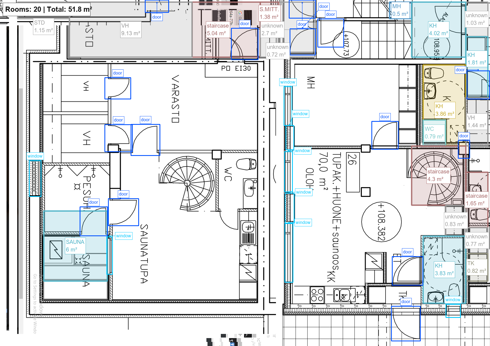
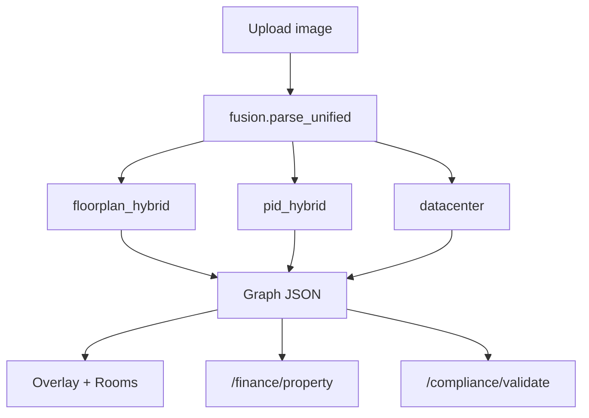

# BlueprintStudio
business video - https://www.youtube.com/watch?v=tV7Kt7pwTSg
tech video - https://youtu.be/ZCjis2257dM

**Upload a Hong Kong floor plan → labeled rooms + m² → instant property valuation + BEEO-ready compliance.**

One graph schema. Five diagram types. Built for HK PropTech and BEEO 2026.



---

## For jurors — run with Docker (recommended)

**Requirements:** [Docker Desktop](https://www.docker.com/products/docker-desktop/) (Windows / Mac) or Docker Engine (Linux).

### 1. Clone and start

```bash
git clone https://github.com/CrashPine/BlueprintStudio.git
cd BlueprintStudio
docker compose up --build
```

First build takes **10–20 minutes** (downloads Python ML stack). Later starts are seconds.

### 2. Open the app

| URL | What it is |
|-----|------------|
| http://localhost:8000 | Main UI — upload / demo / valuation / compliance |
| http://localhost:8000/static/twin.html | 3D building twin |
| http://localhost:8000/static/roadmap.html | Capability map |
| http://localhost:8000/docs | API (Swagger) |

### 3. Demo without API keys (offline-safe)

1. Open http://localhost:8000
2. Click **Load demo** — pre-baked F2 floor plan (20 rooms, overlay, valuation, compliance)
3. Tabs: **Overlay** → **Rooms** → **Valuation** → **Compliance** → **Run compliance check**

No network or API keys needed for the demo path.

### 4. Live parse (optional — needs API keys)

To parse your own floor-plan image:

1. Copy `.env.example` → `.env`
2. Add keys (or mount key files — see below):
   ```
   ANTHROPIC_API_KEY=sk-ant-...
   ROBOFLOW_API_KEY=...
   ```
3. Restart: `docker compose down && docker compose up`
4. Upload a plan on the main page

Keys are **not** in the repo. `docker-compose.yml` mounts `./models` read-only — you can instead place keys in:

- `models/secretapi.txt` (Anthropic, one line)
- `models/roboflow_key.txt` (Roboflow, one line)

### 5. Stop

```bash
docker compose down
```

### Health check

```bash
curl http://localhost:8000/health
# → {"ok":true,"product":"ArchDraft x FlowDraft"}
```

### Jury demo script (automated)

```powershell
.\scripts\demo_jury.ps1              # starts Docker + opens tabs + prints talk track
.\scripts\demo_jury.ps1 -LiveParse   # also smoke-tests live /parse (needs API keys)
```

See **`HONESTY.md`** for what is fully live vs frozen demo assets.

### Optional services

```bash
docker compose --profile postgres up --build   # Postgres for compliance DB
docker compose --profile ollama up --build    # local embeddings (dedup)
```

---

## 3-minute demo script (for presentation)

1. **0:00** — Open http://localhost:8000 → click **Load demo**
2. **0:20** — Overlay tab: "20 rooms, labeled automatically with areas"
3. **0:45** — Rooms tab: scroll the breakdown table
4. **1:10** — Valuation tab: Kowloon district → HKD value + rental ROI
5. **1:40** — Compliance → **Run compliance check**: TIA-942 violations
6. **2:10** — [Roadmap](static/roadmap.html) + [3D Twin](static/twin.html)
7. **2:40** — Q&A

---

## Local development (without Docker)

```powershell
cd eurotech
python -m venv .venv
.venv\Scripts\activate          # Mac/Linux: source .venv/bin/activate
pip install -r requirements.txt

copy .env.example .env            # add API keys for live parse
python -m uvicorn src.api:app --reload
# → http://127.0.0.1:8000
```

Click **Load demo** for a stage-safe demo with no network.

---

## Architecture



| Layer | Modules |
|-------|---------|
| **Parse** | Roboflow + Claude (floor plans), YOLO + Claude (P&ID), OpenCV + Claude (DC) |
| **Schema** | `schemas/graph.schema.json`, `schemas/dc_*.schema.json` |
| **Analytics** | HK property valuation, PUE/BEC, electrical loads |
| **Compliance** | TIA-942 rule extraction + geometry validation |

Full file inventory: [`docs/REPOSITORY_GUIDE.md`](docs/REPOSITORY_GUIDE.md)

## API (key routes)

| Route | Purpose |
|-------|---------|
| `POST /parse` | Upload diagram → graph JSON |
| `POST /overlay` | Render labeled overlay PNG |
| `GET /demo/floorplan` | Frozen demo graph + overlay |
| `POST /finance/property` | HK property valuation |
| `POST /compliance/validate` | TIA-942 geometry check |
| `GET /docs` | Swagger UI |

Production CLI: `python scripts/infer.py <image> --type FLOORPLAN --out data/parsed.json`

## Configuration

| Path | Purpose |
|------|---------|
| `config/bec_rules.yaml` | PUE thresholds, tariff assumptions |
| `config/class_map.yaml` | YOLO class → node type mapping |
| `config/property_prices/` | HK district price/rent tables |
| `models/yolov8n_pid.pt` | Trained P&ID weights (from Kaggle notebook) |

API keys: `ANTHROPIC_API_KEY`, `ROBOFLOW_API_KEY` in `.env` or `models/*.txt` (gitignored).

## Tests

```powershell
python -m uvicorn src.api:app
python tests/test_pipeline.py
```

## Frozen demo assets (stage-safe)

| File | Purpose |
|------|---------|
| `data/demo_floorplan.json` | Parsed F2 floor plan |
| `static/demo/f2_overlay.png` | Pre-baked overlay |
| `data/demo_compliance_report.json` | TIA-942 violations demo |
| `data/demo_datacentre.json` | Fused datacenter demo |

## Docker files

| File | Purpose |
|------|---------|
| `Dockerfile` | Python 3.11 + Tesseract + OpenCV + ML stack |
| `docker-compose.yml` | App on port 8000, optional Postgres/Ollama |
| `.env.example` | API key template (copy to `.env`) |
